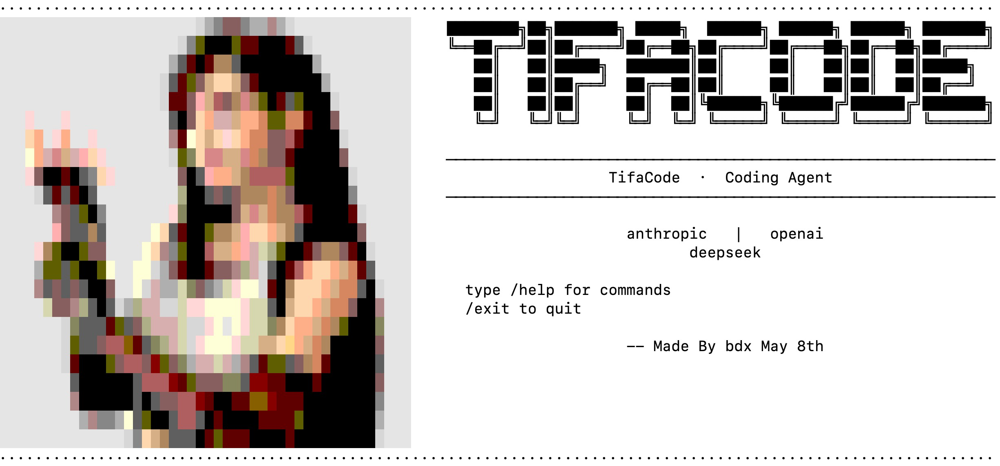

# TifaCode

[English](README.md)

轻量级本地 Coding Agent CLI，面向多轮、多步骤编程任务。围绕可控工具执行、流式输出、会话持久化设计。

---

## 功能

- **多后端 Agent 循环** — 兼容 Anthropic / OpenAI / DeepSeek 后端，流式响应，多轮工具调用
- **Rich CLI 界面** — 交互式 REPL，多行输入（Enter 发送，Shift+Enter 换行），Markdown 流式渲染，ANSI 彩色启动画面
- **4 个核心工具** — 读取文件、写入文件、编辑文件、执行 Bash 命令
- **权限系统** — 危险命令黑名单拦截，Bash 命令执行前需用户确认
- **会话管理** — 命名会话保存至 `~/.tifacode/sessions/`，支持中断恢复
- **自动检测后端** — 根据已设置的 API Key 环境变量自动选择 provider

## 快速启动

**环境要求：** Python 3.9+，Anthropic / OpenAI / DeepSeek API Key

```bash
# 1. 克隆并安装
git clone <repo-url> && cd TifaCode
pip install .

# 2. 设置 API Key（只需设置一个，自动检测）
export DEEPSEEK_API_KEY="sk-..."        # DeepSeek
export ANTHROPIC_API_KEY="sk-ant-..."   # Anthropic
export OPENAI_API_KEY="sk-..."          # OpenAI

# 3. 运行
tifacode                                      # 交互模式
tifacode "列出当前目录下的文件"                   # 单次执行
tifacode --provider openai                    # 切换后端
tifacode --permission-mode plan               # 只读规划模式
tifacode --resume                             # 恢复上次会话
tifacode --list-sessions                      # 列出已保存会话
```

### REPL 命令

| 命令          | 说明             |
|---------------|------------------|
| `/help`       | 显示帮助         |
| `/new [name]` | 新建并切换到一个会话 |
| `/switch <name>` | 切换到已有会话 |
| `/clear`      | 清空当前会话      |
| `/exit`       | 退出程序         |
| `/sessions`   | 列出已保存会话    |
| `/model`      | 显示当前模型      |
| `/permissions`| 显示当前权限模式  |

### 常用指令

```bash
# 启动默认交互会话
tifacode

# 单次执行一个任务
tifacode "阅读 README 并总结项目"

# 新建或进入指定会话
tifacode --session refactor-auth

# 列出所有保存的会话
tifacode --list-sessions

# 恢复最近一次会话
tifacode --resume

# 选择后端和模型
tifacode --provider openai --model gpt-4o

# 使用只读规划模式
tifacode --permission-mode plan

# 允许编辑但 Bash 仍需确认
tifacode --permission-mode acceptEdits
```

交互模式常用命令：

```text
/help                 查看 REPL 命令
/new bugfix-login     新建并切换到 bugfix-login 会话
/new                  自动命名新会话
/switch refactor-auth 切换到已有会话
/sessions             查看已保存会话
/permissions          查看当前权限模式
/clear                清空当前会话
/exit                 退出
```

### 权限模式

| 模式 | 行为 |
|------|------|
| `default` | 读操作直接允许，写入/编辑/Bash 执行前确认 |
| `plan` | 只允许读操作，拒绝写入/编辑/Bash |
| `acceptEdits` | 读/写/编辑直接允许，Bash 执行前确认 |
| `bypassPermissions` | 跳过工具确认（仍保留工具内部安全拦截） |
| `dontAsk` | 只允许读操作，拒绝需要确认的工具 |

可在 `~/.tifacode/config.yaml` 中配置：

```yaml
permission_mode: default
permission_allow_tools: []
permission_deny_tools: []
tool_log_enabled: true
tool_output_limit: 20000
```

## 项目结构

```
TifaCode/
├── main.py            # 入口
├── agent/             # Agent 循环、LLM 后端、消息管理
├── tools/             # 工具基类 + read/write/edit/bash
├── cli/               # Rich CLI 界面 + prompt_toolkit 输入
├── session/           # 会话持久化
├── config/            # 配置（YAML + 环境变量）
├── pyproject.toml
└── setup.py
```
